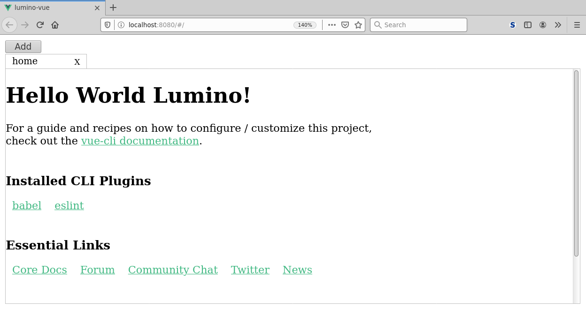

# vue-lumino

An example project showing one way to integrate Vue.js and
[Lumino](https://github.com/jupyterlab/lumino) (née PhosphorJS).



Lumino "is a library for building interactive web applications". It is used by JupyterLab to create the
top menu bar, widgets with close/maximize buttons, and other components that allow users to create
web applications.

Based on work done for [Cylc UI](https://github.com/cylc/cylc-ui).

NB: this is not production-ready code, but purely an example on one way to achieve using Lumino and Vue.js.
The original code uses events to intercept when widgets are added or removed, and the listeners update
DOM and Vue components, trying to make sure there are no memory leaks, no dangling objects, etc. Hopefully
others will find this useful as a reference for one way to achieve the same in their projects.

## Building

```bash
$ yarn install      # install dependencies
$ yarn run serve    # run development server
$ yarn run build    # compiles and minifies for production
$ yarn run test     # run tests
$ yarn run lint     # lint and fix files
```

## License

Licensed under the Apache License. See LICENSE file for more.
